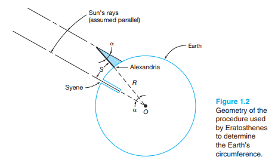
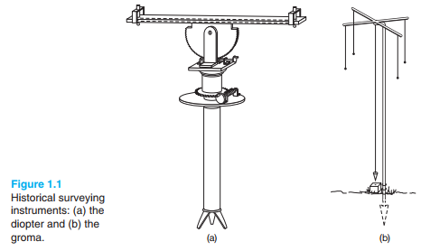

# Pengenalan Survei Pemetaan

## Definisi Survei Pemetaan
*Surveying* atau survei pemetaan menurut (Ghilani dan Wolf, 2015) adalah 
> *Science, art and technology of determining the relative positions of points above, on, or beneath the Earth's surface, or of establishing such points.*

> Terjemahan : Ilmu sains, seni dan teknologi dalam menentukan posisi relatif dari titik yang berada di atas permukaan bumi, di permukaan bumi atau di bawah permukakaan bumi atau menentukan suatu titik

Secara sederhana, pemetaan adalah suatu metode untuk melakukan pemodelan terhadap suatu objek. Objek yang dipetakan dapat berupa permukaan bumi, suatu bidang matematis pendekatan, maupun objek lain. 

Survei pemetaan tanah atau sering disebut dengan survei topografi terbagi menjadi 4 (Gomarasca, 2009):
* Planimetri : Survei yang bertujuan untuk menentukan posisi relatif dari representasi titik pada permukaan bumi dengan referensi permukaan yang sama. Keluaran hasil dari survei ini adalah nilai koordinat horizontal X dan Y
* Altimetri : Survei yang bertujuan untuk menentukan ketinggian sebuah titik pada permukaan bumi. Keluaran hasil dari survei ini adalah nilai koordinat vertikal Z
* Tachimetri : merupakan survei kombinasi dari planimetri dan altimetri. Keluaran hasil dari survei ini adalah koordinat pada bidang horizontal dan vertikal (XYZ)
* Survei pemetaan tanah (*land surveying*) : Survei ini bertujuan untuk menghitung luas, memindahkan dan memperbaiki batas, zona elevasi pada permukaan fisik bumi

## Sejarah Pemetaan
* Sekitar tahun 1400 sebelum Masehi
Herodotus mencatat bahwa Sesostris membagi lahan di Mesir menjadi petak-petak dengan tujuan untuk penarikan pajak. Pada waktu itu, banjir musiman dari sungai Nil menghapus bukti dari petak-petak tersebut. Sehingga surveyor diperlukan untuk mengganti patok batas. Surveyor pada masa itu menggunakan metode *penarikan tali / rope stretchers*, dimana mereka mengukur menggunakan tali yang telah memiliki unit jarak

* Sekitar tahun 200 sebelum Masehi
Sejarah Yunani mencatat mengenai Erastosthenes yang mampu melakukan perhitungan mengenai ukuran sebenarnya bumi. Erastosthenes melakukan perhitungan pada kota Alexandria dan kota Syene di Mesir yang diperkirakan berada pada bujur yang sama. Beliau melakukan pengamatan pada waktu siang hari pada musim panas solstice (hari dimana waktu siang hari terpanjang di musim panas), dimana matahari berada tepat di atas Syene. Hal ini diketahui dimana pada saat itu sinar matahari memantul dari dasar sebuah sumur vertikal. Beliau berargumen bahwa pada saat yang sama, matahari yang ada di Alexandria memiliki kemiringan sudut yang berbeda pada sumur vertikal. Berdasarkan perbedaan sudut tersebut, Erastosthenes melakukan perhitungan keliling dari bumi sekitar 25.000 mil.

Sumber : (Ghilani dan Wolf, 2015) 

* Sekitar tahun 120 sebelum Masehi
Masa dimana bangsa Yunani mulai mengembangkan ilmu geometri. Heron menerapkan konsep geometri ini pada pemetaan. *The Dioptra* merupakan karya yang dikembangkan oleh Heron dimana berhubungan dengan metode survei pada sebuah lahan, menggambarkan bidang, dan melakukan perhitungan berkaitan dengan pemetaan. Heron juga menjabarkan salah satu alat survey pertama yang dinamakan *diopter*.

* sekitar tahun 40 - 103 Masehi
Frontius, seorang insinyur sipil terkenal berbangsa Romawi mengenalkan pentingnya survei pemetaan pada bidang konstruksi. Pada masa ini dikenalkan *the groma* yang digunakan untuk pengamatan dilengkapi dengan unting-unting.

Sumber : (Ghilani dan Wolf, 2015) 

* Abad ke-6 Masehi
*Codex Acerianus* adalah salah manuskrip latin tertua. Dalam naskah tersebut tertulis metode pemetaan yang dipraktikan oleh bangsa Romawi dan termasuk beberapa lembar tulisan dari Frontius. Naskah ini ditemukan oleh Gerbert pada abad ke-10 dan digunakan sebagai dasar geometri pada tulisan dari Gerbert

* Abad Pertengahan
Bangsa Arab mempertahankan ilmu sains dari bangsa Yunani dan Romawi tetap eksis. Bangsa Arab mulai mengembangkan ilmu geometri praktikal

* Abad ke-13 Masehi
Von Piso menulis mengenai *Practica Geometria* yang mencantumkan mengenai instruksi dalam pemetaan. Beliau juga menulis *Liber Quadratorum* yang memiliki bahasan utama mengenai konsep kuadran, sebuah kerangka kuningan dengan sudut 90 derajat dan beberapa perubahan skala.

* Abad ke-18 dan ke-19 Masehi
Ilmu pemetaan berkembang pesat. Hal ini ditandai dengan meninggkatnya kebutuhan peta dan lokasi dari batas nasional Inggris dan Prancis yang membuat survei mendalam yang membutuhkan pemetaan triangulasi yang akurat. Di waktu yang sama, survei pemetaan geodetis mulai dikembangkan. Amerika Serikat meresmikan pakta Kongres pada tahun 1807 yang mengatur mengenai survei hidrografi dan persiapan peta laut (*nautical chart*).

* Masa Perang Dunia
Masa perang dunia dan perang di berbagai belahan dunia merupakan stimulus dalam perkembangan ilmu pemetaan.

* tahun 1960 - 1970 
Teknologi pemetaan semakin berkembang dengan dikenalkannya *Global Navigation Satellite System* salah satunya adalah GPS dari Amerika 

## Referensi 
* Ghillani, C. D. & Wolf, P. R.(2015).Elementary Surveying: An introduction to geomatics (14th Ed.)
* Gomarasca, M. A.(2009).Basics of Geomatics. Springer Netherlands
